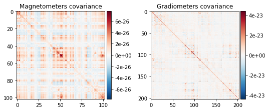
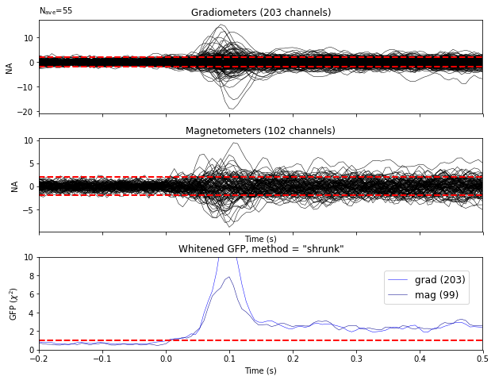
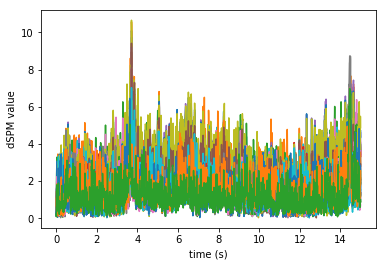
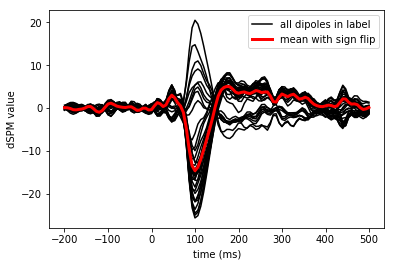
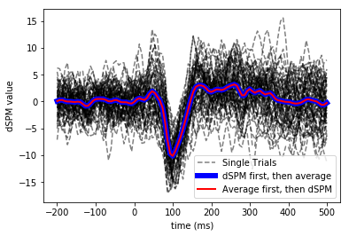

---
redirect_from:
  - "/evoked-to-stc/stc"
interact_link: content/evoked_to_stc/stc.ipynb
kernel_name: python3
has_widgets: false
title: 'Source time course'
prev_page:
  url: /evoked_to_stc/readme
  title: 'Evoked to source space'
next_page:
  url: /evoked_to_stc/forward
  title: 'Forward model'
comment: "***PROGRAMMATICALLY GENERATED, DO NOT EDIT. SEE ORIGINAL FILES IN /content***"
---

# Source localization with MNE/dSPM/sLORETA

The aim of this lecture is to teach you how to compute and apply
a linear inverse method such as MNE/dSPM/sLORETA on evoked/raw/epochs data.


{:.input_area}
```python
%matplotlib inline
```


{:.input_area}
```python
import numpy as np
import matplotlib.pyplot as plt

import mne
```


## Recap: going from raw to evoked


{:.input_area}
```python
from mne.datasets import sample
data_path = sample.data_path()

raw_fname = data_path + '/MEG/sample/sample_audvis_filt-0-40_raw.fif'

raw = mne.io.read_raw_fif(raw_fname)
```


{:.output .output_stream}
```
Opening raw data file /home/mainak/Desktop/projects/github_repos/mne-python/examples/MNE-sample-data/MEG/sample/sample_audvis_filt-0-40_raw.fif...
    Read a total of 4 projection items:
        PCA-v1 (1 x 102)  idle
        PCA-v2 (1 x 102)  idle
        PCA-v3 (1 x 102)  idle
        Average EEG reference (1 x 60)  idle
    Range : 6450 ... 48149 =     42.956 ...   320.665 secs
Ready.
Current compensation grade : 0

```


{:.input_area}
```python
events = mne.find_events(raw, stim_channel='STI 014')
```


{:.output .output_stream}
```
319 events found
Event IDs: [ 1  2  3  4  5 32]

```


{:.input_area}
```python
event_id = dict(aud_l=1)  # event trigger and conditions
tmin, tmax = -0.2, 0.5
raw.info['bads'] = ['MEG 2443', 'EEG 053']
picks = mne.pick_types(raw.info, meg=True, eeg=False, eog=True, exclude='bads')
reject = dict(grad=4000e-13, mag=4e-12, eog=150e-6)

epochs = mne.Epochs(raw, events, event_id, tmin, tmax, proj=True,
                    picks=picks, reject=reject, preload=True, verbose=False)
evoked = epochs.average()
```


## Math of Source estimation

To compute source estimates, one typically assumes:
    
$$M = GX + E$$

where $M \in \mathbb{R}^{C \times T}$ is the sensor data, $G \in \mathbb{R}^{C \times S}$ is the lead-field (or gain) matrix, $X \in \mathbb{R}^{S \times T}$ is the source time course (stc) and $E \in \mathbb{R}^{C \times T}$ is additive Gaussian noise with zero mean and identity covariance

However, noise $E$ does not have identity covariance because of correlation between channels.
Thus, the noise covariance is computed empirically and made to be identity by "whitening"(more on this later ...)

Thus, the ingredients needed for source estimation are:
    
- the gain matrix $G$, computed during the forward calculation, which needs:
     - *Trans*: the coordinate transformation between head and MEG device
     - *Source space*: specifying the mesh on which we estimate the source current amplitudes
     - *Boundary element model (BEM)*: specifying the tissue profile and conductivity
- noise covariance matrix $EE{^\top}/T$

## Compute noise covariance


{:.input_area}
```python
noise_cov = mne.compute_covariance(epochs, tmax=0.,
                                   method=['shrunk', 'empirical'])
print(noise_cov.data.shape)
```


{:.output .output_stream}
```
Computing data rank from raw with rank=None
Using tolerance 2.8e-09 (2.2e-16 eps * 305 dim * 4.2e+04 max  singular value)
Estimated rank (mag + grad): 302
    MEG: rank 302 computed from 3s data channels with 305 projectors
    Created an SSP operator (subspace dimension = 3)
Setting small MEG eigenvalues to zero.
Not doing PCA for MEG.
Reducing data rank from 305 -> 302
Estimating covariance using SHRUNK
Done.
Estimating covariance using EMPIRICAL
Done.
Using cross-validation to select the best estimator.
Number of samples used : 1705
log-likelihood on unseen data (descending order):
   shrunk: -1469.209
   empirical: -1574.608
selecting best estimator: shrunk
[done]
(305, 305)

```


{:.input_area}
```python
mne.viz.plot_cov(noise_cov, raw.info)
```


{:.output .output_png}



{:.output .output_png}


{:.output .output_data_text}
```
(<Figure size 547.2x266.4 with 4 Axes>, <Figure size 547.2x266.4 with 2 Axes>)
```


# Show whitening

We can verify that the standard deviation is 1


{:.input_area}
```python
evoked.plot_white(noise_cov, verbose=False);
```


{:.output .output_png}



## Inverse modeling with MNE and dSPM on evoked and raw data


{:.input_area}
```python
from mne.forward import read_forward_solution
from mne.minimum_norm import (make_inverse_operator, apply_inverse,
                              write_inverse_operator)
```


MNE/dSPM/sLORETA lead to linear inverse model that can be precomputed and applied to data in a later stage.


{:.input_area}
```python
fname_fwd = data_path + '/MEG/sample/sample_audvis-meg-oct-6-fwd.fif'
fwd = mne.read_forward_solution(fname_fwd, verbose=False)

inverse_operator = make_inverse_operator(evoked.info, fwd, noise_cov,
                                         loose=0.2, depth=0.8, verbose=False)
```


## Compute inverse solution / Apply inverse operators


{:.input_area}
```python
method = "dSPM"
snr = 3.
lambda2 = 1. / snr ** 2
stc = apply_inverse(evoked, inverse_operator, lambda2,
                    method=method, pick_ori=None, verbose=False)
print(stc)
```


{:.output .output_stream}
```
<SourceEstimate  |  7498 vertices, subject : sample, tmin : -199.79521315838787 (ms), tmax : 499.48803289596964 (ms), tstep : 6.659840438612929 (ms), data shape : (7498, 106)>

```


{:.input_area}
```python
stc.data.shape
```


{:.output .output_data_text}
```
(7498, 106)
```


{:.input_area}
```python
stc.save('fixed_ori')
```


{:.output .output_stream}
```
Writing STC to disk...
[done]

```

The STC (Source Time Courses) are defined on a source space formed by 7498 candidate
locations and for a duration spanning 106 time instants.

## Show the result


{:.input_area}
```python
from mayavi import mlab
mlab.init_notebook('png')

subjects_dir = data_path + '/subjects'
brain = stc.plot(surface='inflated', hemi='rh', subjects_dir=subjects_dir)
brain.set_data_time_index(45)
brain.scale_data_colormap(fmin=8, fmid=12, fmax=15, transparent=True)
brain.show_view('lateral');
mlab.show()
```


{:.output .output_stream}
```
Notebook initialized with png backend.
Using control points [ 3.63327823  4.26167739 17.03691213]
colormap sequential: [8.00e+00, 1.20e+01, 1.50e+01] (transparent)

```


{:.input_area}
```python
brain.save_image('dspm.jpg')
from IPython.display import Image
Image(filename='dspm.jpg', width=600)
```


## Morphing data to an average brain for group studies


{:.input_area}
```python
subjects_dir = data_path + '/subjects'
morph = mne.compute_source_morph(stc, subject_from='sample', subject_to='fsaverage',
                                 subjects_dir=subjects_dir)
stc_fsaverage = morph.apply(stc)
```


{:.input_area}
```python
stc_fsaverage.save('fsaverage_dspm')
```


{:.output .output_stream}
```
Writing STC to disk...
[done]

```


{:.input_area}
```python
brain_fsaverage = stc_fsaverage.plot(surface='inflated', hemi='rh',
                                     subjects_dir=subjects_dir)
brain_fsaverage.set_data_time_index(45)
brain_fsaverage.scale_data_colormap(fmin=8, fmid=12, fmax=15, transparent=True)
brain_fsaverage.show_view('lateral')
```


{:.output .output_stream}
```
Using control points [ 3.35412831  3.91588156 14.82235775]
colormap sequential: [8.00e+00, 1.20e+01, 1.50e+01] (transparent)

```


{:.output .output_data_text}
```
((-7.016709298534877e-15, 90.0, 430.9261779785156, array([0., 0., 0.])), -90.0)
```


{:.input_area}
```python
brain_fsaverage.save_image('dspm_fsaverage.jpg')
from IPython.display import Image
Image(filename='dspm_fsaverage.jpg', width=600)
```


### Solving the inverse problem on raw data or epochs using Freesurfer labels


{:.input_area}
```python
fname_label = data_path + '/MEG/sample/labels/Aud-lh.label'
label = mne.read_label(fname_label)
```


Compute inverse solution during the first 15s:


{:.input_area}
```python
from mne.minimum_norm import apply_inverse_raw, apply_inverse_epochs
start, stop = raw.time_as_index([0, 15])  # read the first 15s of data
stc = apply_inverse_raw(raw, inverse_operator, lambda2, method, label,
                        start, stop)
```


{:.output .output_stream}
```
Preparing the inverse operator for use...
    Scaled noise and source covariance from nave = 1 to nave = 1
    Created the regularized inverter
    Created an SSP operator (subspace dimension = 3)
    Created the whitener using a noise covariance matrix with rank 302 (3 small eigenvalues omitted)
    Computing noise-normalization factors (dSPM)...
[done]
Applying inverse to raw...
    Picked 305 channels from the data
    Computing inverse...
    Eigenleads need to be weighted ...
    combining the current components...
[done]

```

Plot the dSPM time courses in the label


{:.input_area}
```python
%matplotlib inline
plt.plot(stc.times, stc.data.T)
plt.xlabel('time (s)')
plt.ylabel('dSPM value')
```


{:.output .output_data_text}
```
Text(0, 0.5, 'dSPM value')
```


{:.output .output_png}



And on epochs:


{:.input_area}
```python
# Compute inverse solution and stcs for each epoch
# Use the same inverse operator as with evoked data (i.e., set nave)
# If you use a different nave, dSPM just scales by a factor sqrt(nave)

stcs = apply_inverse_epochs(epochs, inverse_operator, lambda2, method, label,
                            pick_ori="normal", nave=evoked.nave)

stc_evoked = apply_inverse(evoked, inverse_operator, lambda2, method,
                           pick_ori="normal")

stc_evoked_label = stc_evoked.in_label(label)

# Average over label (not caring to align polarities here)
label_mean_evoked = np.mean(stc_evoked_label.data, axis=0)
```


{:.output .output_stream}
```
Preparing the inverse operator for use...
    Scaled noise and source covariance from nave = 1 to nave = 55
    Created the regularized inverter
    Created an SSP operator (subspace dimension = 3)
    Created the whitener using a noise covariance matrix with rank 302 (3 small eigenvalues omitted)
    Computing noise-normalization factors (dSPM)...
[done]
Picked 305 channels from the data
Computing inverse...
    Eigenleads need to be weighted ...
Processing epoch : 1 / 55
Processing epoch : 2 / 55
Processing epoch : 3 / 55
Processing epoch : 4 / 55
Processing epoch : 5 / 55
Processing epoch : 6 / 55
Processing epoch : 7 / 55
Processing epoch : 8 / 55
Processing epoch : 9 / 55
Processing epoch : 10 / 55
Processing epoch : 11 / 55
Processing epoch : 12 / 55
Processing epoch : 13 / 55
Processing epoch : 14 / 55
Processing epoch : 15 / 55
Processing epoch : 16 / 55
Processing epoch : 17 / 55
Processing epoch : 18 / 55
Processing epoch : 19 / 55
Processing epoch : 20 / 55
Processing epoch : 21 / 55
Processing epoch : 22 / 55
Processing epoch : 23 / 55
Processing epoch : 24 / 55
Processing epoch : 25 / 55
Processing epoch : 26 / 55
Processing epoch : 27 / 55
Processing epoch : 28 / 55
Processing epoch : 29 / 55
Processing epoch : 30 / 55
Processing epoch : 31 / 55
Processing epoch : 32 / 55
Processing epoch : 33 / 55
Processing epoch : 34 / 55
Processing epoch : 35 / 55
Processing epoch : 36 / 55
Processing epoch : 37 / 55
Processing epoch : 38 / 55
Processing epoch : 39 / 55
Processing epoch : 40 / 55
Processing epoch : 41 / 55
Processing epoch : 42 / 55
Processing epoch : 43 / 55
Processing epoch : 44 / 55
Processing epoch : 45 / 55
Processing epoch : 46 / 55
Processing epoch : 47 / 55
Processing epoch : 48 / 55
Processing epoch : 49 / 55
Processing epoch : 50 / 55
Processing epoch : 51 / 55
Processing epoch : 52 / 55
Processing epoch : 53 / 55
Processing epoch : 54 / 55
Processing epoch : 55 / 55
[done]
Preparing the inverse operator for use...
    Scaled noise and source covariance from nave = 1 to nave = 55
    Created the regularized inverter
    Created an SSP operator (subspace dimension = 3)
    Created the whitener using a noise covariance matrix with rank 302 (3 small eigenvalues omitted)
    Computing noise-normalization factors (dSPM)...
[done]
Applying inverse operator to "aud_l"...
    Picked 305 channels from the data
    Computing inverse...
    Eigenleads need to be weighted ...
    Computing residual...
    Explained  66.1% variance
    dSPM...
[done]

```

Mean across trials but not across vertices in label


{:.input_area}
```python
mean_stc = np.sum(stcs) / len(stcs)
```


Take the mean across vertices in an ROI


{:.input_area}
```python
flip = mne.label_sign_flip(label, inverse_operator['src'])

label_mean = np.mean(mean_stc.data, axis=0)
label_mean_flip = np.mean(flip[:, np.newaxis] * mean_stc.data, axis=0)
```


View activation time-series to illustrate the benefit of aligning/flipping


{:.input_area}
```python
times = 1e3 * stcs[0].times  # times in ms

plt.figure()
h0 = plt.plot(times, mean_stc.data.T, 'k')
h1, = plt.plot(times, label_mean_flip, 'r', linewidth=3)
plt.legend((h0[0], h1), ('all dipoles in label',
                             'mean with sign flip'))
plt.xlabel('time (ms)')
plt.ylabel('dSPM value')
plt.show()
```


{:.output .output_png}



Viewing single trial dSPM and average dSPM for unflipped pooling over label

Compare to (1) Inverse (dSPM) then average, (2) Evoked then dSPM


{:.input_area}
```python
# Single trial
plt.figure()
for k, stc_trial in enumerate(stcs):
    plt.plot(times, np.mean(stc_trial.data, axis=0).T, 'k--',
             label='Single Trials' if k == 0 else '_nolegend_',
             alpha=0.5)

# Single trial inverse then average.. making linewidth large to not be masked
plt.plot(times, label_mean, 'b', linewidth=6,
         label='dSPM first, then average')

# Evoked and then inverse
plt.plot(times, label_mean_evoked, 'r', linewidth=2,
         label='Average first, then dSPM')

plt.xlabel('time (ms)')
plt.ylabel('dSPM value')
plt.legend()
plt.show()
```


{:.output .output_png}



## Exercises
- Run sLORETA on the same data and compare source localizations
- Run an LCMV beamformer on the same data and compare source localizations
