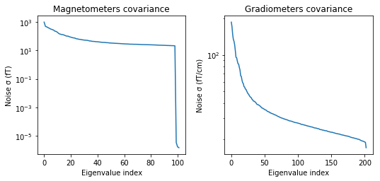
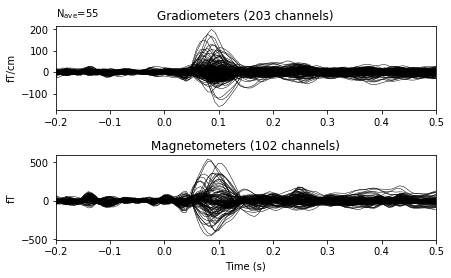
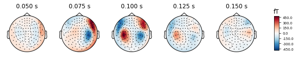

---
redirect_from:
  - "/evoked-to-stc/stc"
interact_link: content/evoked_to_stc/stc.ipynb
kernel_name: python3
title: 'Source time course'
prev_page:
  url: /evoked_to_stc/forward
  title: 'Forward model'
next_page:
  url: 
  title: ''
comment: "***PROGRAMMATICALLY GENERATED, DO NOT EDIT. SEE ORIGINAL FILES IN /content***"
---

# Source localization with MNE/dSPM/sLORETA

The aim of this lecture is to teach you how to compute and apply
a linear inverse method such as MNE/dSPM/sLORETA on evoked/raw/epochs data.

`
Authors: Alexandre Gramfort <alexandre.gramfort@telecom-paristech.fr>
         Denis Engemann <denis.engemann@gmail.com>
`


{:.input_area}
```python
# add plot inline in the page
%matplotlib inline

import numpy as np
import matplotlib.pyplot as plt

import mne
mne.set_log_level('WARNING')
```


## Process MEG data


{:.input_area}
```python
from mne.datasets import sample
data_path = sample.data_path()
# data_path = '/Users/alex/mne_data/MNE-sample-data'

raw_fname = data_path + '/MEG/sample/sample_audvis_filt-0-40_raw.fif'

raw = mne.io.read_raw_fif(raw_fname)
print(raw)
```


{:.output .output_stream}
```
<Raw  |  sample_audvis_filt-0-40_raw.fif, n_channels x n_times : 376 x 41700 (277.7 sec), ~3.6 MB, data not loaded>

```

Looking at meta data, a.k.a. measurement info, such sampling frequency, channels etc.


{:.input_area}
```python
print(raw.info['sfreq'])
```


{:.output .output_stream}
```
150.15374755859375

```

### Define epochs and compute ERP/ERF

First look for events / triggers


{:.input_area}
```python
events = mne.find_events(raw, stim_channel='STI 014')
```


{:.input_area}
```python
event_id = dict(aud_l=1)  # event trigger and conditions
tmin = -0.2  # start of each epoch (200ms before the trigger)
tmax = 0.5  # end of each epoch (500ms after the trigger)
raw.info['bads'] = ['MEG 2443', 'EEG 053']
picks = mne.pick_types(raw.info, meg=True, eeg=False, eog=True, exclude='bads')
baseline = (None, 0)  # means from the first instant to t = 0
reject = dict(grad=4000e-13, mag=4e-12, eog=150e-6)

epochs = mne.Epochs(raw, events, event_id, tmin, tmax, proj=True,
                    picks=picks, baseline=baseline, reject=reject)
epochs.drop_bad()
print(epochs.selection.shape)
print(epochs)
```


{:.output .output_stream}
```
(55,)
<Epochs  |   55 events (all good), -0.199795 - 0.499488 sec, baseline [None, 0], ~3.5 MB, data not loaded,
 'aud_l': 55>

```

## Compute noise covariance

See

Engemann D.A., Gramfort A., Automated model selection in covariance estimation and spatial whitening of MEG and EEG signals, Neuroimage. 2015 Mar


{:.input_area}
```python
noise_cov = mne.compute_covariance(epochs, tmax=0.,
                                   method=['shrunk', 'empirical'])
print(noise_cov.data.shape)
```


{:.output .output_stream}
```
(305, 305)

```


{:.input_area}
```python
mne.viz.plot_cov(noise_cov, raw.info)
```


{:.output .output_png}


{:.output .output_png}



{:.output .output_data_text}
```
(<Figure size 547.2x266.4 with 4 Axes>, <Figure size 547.2x266.4 with 2 Axes>)
```


## Compute the evoked response


{:.input_area}
```python
evoked = epochs.average()
evoked.plot()
evoked.plot_topomap(times=np.linspace(0.05, 0.15, 5), ch_type='mag');
```


{:.output .output_png}



{:.output .output_png}



# Show whitening


{:.input_area}
```python
evoked.plot_white(noise_cov);
```


{:.output .output_png}


## Inverse modeling with MNE and dSPM on evoked and raw data

Import the required functions:


{:.input_area}
```python
from mne.forward import read_forward_solution
from mne.minimum_norm import (make_inverse_operator, apply_inverse,
                              write_inverse_operator)
```


## Read the forward solution and compute the inverse operator

MNE/dSPM/sLORETA lead to linear inverse model than are independant
from the data (just the noise covariance) and can therefore be
precomputed and applied to data in a later stage.


{:.input_area}
```python
fname_fwd = data_path + '/MEG/sample/sample_audvis-meg-oct-6-fwd.fif'
fwd = mne.read_forward_solution(fname_fwd)

# Restrict forward solution as necessary for MEG
fwd = mne.pick_types_forward(fwd, meg=True, eeg=False)

# make an M/EEG, MEG-only, and EEG-only inverse operators
info = evoked.info
inverse_operator = make_inverse_operator(info, fwd, noise_cov,
                                         loose=0.2, depth=0.8)

write_inverse_operator('sample_audvis-meg-oct-6-inv.fif',
                       inverse_operator)
```


## Compute inverse solution / Apply inverse operators


{:.input_area}
```python
method = "dSPM"
snr = 3.
lambda2 = 1. / snr ** 2
stc = apply_inverse(evoked, inverse_operator, lambda2,
                    method=method, pick_ori=None)
print(stc)
```


{:.output .output_stream}
```
<SourceEstimate  |  7498 vertices, subject : sample, tmin : -199.79521315838787 (ms), tmax : 499.48803289596964 (ms), tstep : 6.659840438612929 (ms), data shape : (7498, 106)>

```


{:.input_area}
```python
stc.data.shape
```


{:.output .output_data_text}
```
(7498, 106)
```


{:.input_area}
```python
stc.save('fixed_ori')
```


{:.input_area}
```python
# make one with no orientation constraint (free orientation)
# inverse_operator = make_inverse_operator(info, fwd, noise_cov,
#                                          loose=1., depth=0.8)
# stc = apply_inverse(evoked, inverse_operator, lambda2,
#                     method=method, pick_ori=None)
# stc.save('free_ori')
```


The STC (Source Time Courses) are defined on a source space formed by 7498 candidate
locations and for a duration spanning 106 time instants.

## Show the result


{:.input_area}
```python
from mayavi import mlab
mlab.init_notebook('png')

subjects_dir = data_path + '/subjects'
brain = stc.plot(surface='inflated', hemi='rh', subjects_dir=subjects_dir)
brain.set_data_time_index(45)
brain.scale_data_colormap(fmin=8, fmid=12, fmax=15, transparent=True)
brain.show_view('lateral');
mlab.show()
```


{:.output .output_stream}
```
Notebook initialized with png backend.
colormap sequential: [8.00e+00, 1.20e+01, 1.50e+01] (transparent)

```


{:.input_area}
```python
brain.save_image('dspm.jpg')
from IPython.display import Image
Image(filename='dspm.jpg', width=600)
```


## Morphing data to an average brain for group studies


{:.input_area}
```python
subjects_dir = data_path + '/subjects'
stc_fsaverage = stc.morph(subject_to='fsaverage', subjects_dir=subjects_dir)
```


{:.input_area}
```python
stc_fsaverage.save('fsaverage_dspm')
```


{:.output .output_traceback_line}
```

    ---------------------------------------------------------------------------

    NameError                                 Traceback (most recent call last)

    <ipython-input-19-98039c85d2eb> in <module>()
    ----> 1 stc_fsaverage.save('fsaverage_dspm')
    

    NameError: name 'stc_fsaverage' is not defined


```


{:.input_area}
```python
brain_fsaverage = stc_fsaverage.plot(surface='inflated', hemi='rh',
                                     subjects_dir=subjects_dir)
brain_fsaverage.set_data_time_index(45)
brain_fsaverage.scale_data_colormap(fmin=8, fmid=12, fmax=15, transparent=True)
brain_fsaverage.show_view('lateral')
```


{:.input_area}
```python
brain_fsaverage.save_image('dspm_fsaverage.jpg')
from IPython.display import Image
Image(filename='dspm_fsaverage.jpg', width=600)
```


### Solving the inverse problem on raw data or epochs using Freesurfer labels


{:.input_area}
```python
fname_label = data_path + '/MEG/sample/labels/Aud-lh.label'
label = mne.read_label(fname_label)
```


Compute inverse solution during the first 15s:


{:.input_area}
```python
from mne.minimum_norm import apply_inverse_raw, apply_inverse_epochs

start, stop = raw.time_as_index([0, 15])  # read the first 15s of data

stc = apply_inverse_raw(raw, inverse_operator, lambda2, method, label,
                        start, stop)
```


Plot the dSPM time courses in the label


{:.input_area}
```python
%matplotlib inline
plt.plot(stc.times, stc.data.T)
plt.xlabel('time (s)')
plt.ylabel('dSPM value')
```


And on epochs:


{:.input_area}
```python
# Compute inverse solution and stcs for each epoch
# Use the same inverse operator as with evoked data (i.e., set nave)
# If you use a different nave, dSPM just scales by a factor sqrt(nave)

stcs = apply_inverse_epochs(epochs, inverse_operator, lambda2, method, label,
                            pick_ori="normal", nave=evoked.nave)

stc_evoked = apply_inverse(evoked, inverse_operator, lambda2, method,
                           pick_ori="normal")

stc_evoked_label = stc_evoked.in_label(label)

# Mean across trials but not across vertices in label
mean_stc = np.sum(stcs) / len(stcs)
```


{:.input_area}
```python
# compute sign flip to avoid signal cancelation when averaging signed values
flip = mne.label_sign_flip(label, inverse_operator['src'])

label_mean = np.mean(mean_stc.data, axis=0)
label_mean_flip = np.mean(flip[:, np.newaxis] * mean_stc.data, axis=0)

# Average over label (not caring to align polarities here)
label_mean_evoked = np.mean(stc_evoked_label.data, axis=0)
```


View activation time-series to illustrate the benefit of aligning/flipping


{:.input_area}
```python
times = 1e3 * stcs[0].times  # times in ms

plt.figure()
h0 = plt.plot(times, mean_stc.data.T, 'k')
h1, = plt.plot(times, label_mean, 'r', linewidth=3)
h2, = plt.plot(times, label_mean_flip, 'g', linewidth=3)
plt.legend((h0[0], h1, h2), ('all dipoles in label', 'mean',
                             'mean with sign flip'))
plt.xlabel('time (ms)')
plt.ylabel('dSPM value')
plt.show()
```


Viewing single trial dSPM and average dSPM for unflipped pooling over label
Compare to (1) Inverse (dSPM) then average, (2) Evoked then dSPM


{:.input_area}
```python
# Single trial
plt.figure()
for k, stc_trial in enumerate(stcs):
    plt.plot(times, np.mean(stc_trial.data, axis=0).T, 'k--',
             label='Single Trials' if k == 0 else '_nolegend_',
             alpha=0.5)

# Single trial inverse then average.. making linewidth large to not be masked
plt.plot(times, label_mean, 'b', linewidth=6,
         label='dSPM first, then average')

# Evoked and then inverse
plt.plot(times, label_mean_evoked, 'r', linewidth=2,
         label='Average first, then dSPM')

plt.xlabel('time (ms)')
plt.ylabel('dSPM value')
plt.legend()
plt.show()
```


## Exercises
- Run sLORETA on the same data and compare source localizations
- Run an LCMV beamformer on the same data and compare source localizations

### Going further:
- http://martinos.org/mne/dev/auto_examples/inverse/plot_compute_mne_inverse_epochs_in_label.html
- http://martinos.org/mne/dev/auto_examples/inverse/plot_label_source_activations.html
- http://martinos.org/mne/dev/auto_examples/inverse/plot_label_from_stc.html
