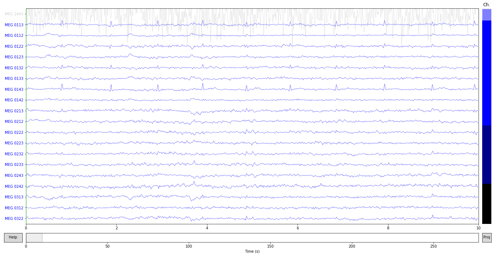
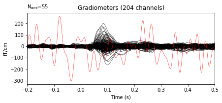
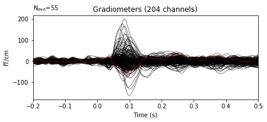

{:.input_area}
```python
%matplotlib inline
```


We will be covering

* [Marking bad channels](#Marking-bad-channels)
* [Marking bad epochs](#Marking-bad-epochs)
* [Using autoreject to automatically mark bad channels and epochs](#Autoreject)

Let's first load the raw data as usual


{:.input_area}
```python
import numpy as np
import mne
from mne.datasets import sample

data_path = sample.data_path()
raw_fname = data_path + '/MEG/sample/sample_audvis_filt-0-40_raw.fif'
raw = mne.io.read_raw_fif(raw_fname, preload=True)  # already has an EEG ref
```


{:.output .output_stream}
```
Opening raw data file /home/mainak/Desktop/projects/github_repos/mne-python/examples/MNE-sample-data/MEG/sample/sample_audvis_filt-0-40_raw.fif...
    Read a total of 4 projection items:
        PCA-v1 (1 x 102)  idle
        PCA-v2 (1 x 102)  idle
        PCA-v3 (1 x 102)  idle
        Average EEG reference (1 x 60)  idle
    Range : 6450 ... 48149 =     42.956 ...   320.665 secs
Ready.
Current compensation grade : 0
Reading 0 ... 41699  =      0.000 ...   277.709 secs...

```

Marking bad channels
==================

If you already know which are the bad channels, simply do:


{:.input_area}
```python
raw.info['bads'] = ['MEG 2443']
```


You can also mark them interactively in `raw.plot()`. The bad channel is shown in gray


{:.input_area}
```python
ch_names = raw.info['ch_names'].copy()
ch_names.remove('MEG 2443')
raw.reorder_channels(['MEG 2443'] + ch_names)
raw.plot();
```


{:.output .output_png}



It's not only `raw`. You can mark bads also in `evoked`. Let's first read in the evoked data.


{:.input_area}
```python
# Reading data with a bad channel marked as bad:
fname = data_path + '/MEG/sample/sample_audvis-ave.fif'
evoked = mne.read_evokeds(fname, condition='Left Auditory',
                          baseline=(None, 0))
evoked.pick_types(meg='grad', eeg=False, exclude=[])

# plot with bads
evoked.plot(exclude=[], time_unit='s');
```


{:.output .output_stream}
```
Reading /home/mainak/Desktop/projects/github_repos/mne-python/examples/MNE-sample-data/MEG/sample/sample_audvis-ave.fif ...
    Read a total of 4 projection items:
        PCA-v1 (1 x 102) active
        PCA-v2 (1 x 102) active
        PCA-v3 (1 x 102) active
        Average EEG reference (1 x 60) active
    Found the data of interest:
        t =    -199.80 ...     499.49 ms (Left Auditory)
        0 CTF compensation matrices available
        nave = 55 - aspect type = 100
Projections have already been applied. Setting proj attribute to True.
Applying baseline correction (mode: mean)

```


{:.output .output_png}



It's also possible to repair the bad channels using interpolation


{:.input_area}
```python
evoked.interpolate_bads(reset_bads=False, verbose=False);
```


Let’s plot the cleaned data


{:.input_area}
```python
evoked.plot(exclude=[], time_unit='s');
```


{:.output .output_png}



Marking bad epochs
--------------------

MNE allows you to specify rejection dictionary based on peak-to-peak thresholds for each channel type


{:.input_area}
```python
reject = dict(grad=4000e-13, mag=4e-12, eog=200e-6)
```


{:.input_area}
```python
events = mne.find_events(raw, stim_channel='STI 014')
event_id = {"auditory/left": 1}
tmin, tmax = -0.2, 0.5
baseline = (None, 0)  # means from the first instant to t = 0
picks = mne.pick_types(raw.info, meg=True, eeg=True, eog=True,
                       stim=False, exclude='bads')
epochs = mne.Epochs(raw, events, event_id, tmin, tmax, proj=True,
                    picks=picks, baseline=baseline, reject=reject,                    
                    preload=True)
```


{:.output .output_stream}
```
319 events found
Event IDs: [ 1  2  3  4  5 32]
72 matching events found
Applying baseline correction (mode: mean)
Not setting metadata
Created an SSP operator (subspace dimension = 4)
4 projection items activated
Loading data for 72 events and 106 original time points ...
    Rejecting  epoch based on EOG : ['EOG 061']
    Rejecting  epoch based on EOG : ['EOG 061']
    Rejecting  epoch based on EOG : ['EOG 061']
    Rejecting  epoch based on MAG : ['MEG 1711']
    Rejecting  epoch based on EOG : ['EOG 061']
    Rejecting  epoch based on EOG : ['EOG 061']
    Rejecting  epoch based on EOG : ['EOG 061']
    Rejecting  epoch based on EOG : ['EOG 061']
    Rejecting  epoch based on EOG : ['EOG 061']
9 bad epochs dropped

```

You can also reject after constructing epochs, just do:


{:.input_area}
```python
reject.update({'eog': 150e-6})
epochs.drop_bad(reject=reject)
```


{:.output .output_stream}
```
    Rejecting  epoch based on EOG : ['EOG 061']
    Rejecting  epoch based on EOG : ['EOG 061']
    Rejecting  epoch based on EOG : ['EOG 061']
    Rejecting  epoch based on EOG : ['EOG 061']
    Rejecting  epoch based on EOG : ['EOG 061']
    Rejecting  epoch based on EOG : ['EOG 061']
    Rejecting  epoch based on EOG : ['EOG 061']
    Rejecting  epoch based on EOG : ['EOG 061']
8 bad epochs dropped

```


{:.output .output_data_text}
```
<Epochs  |   55 events (all good), -0.199795 - 0.499488 sec, baseline [None, 0], ~19.9 MB, data loaded,
 'auditory/left': 55>
```


But the thresholds need to be stricter each time.

Tuning rejection thresholds
---------------------------


{:.input_area}
```python
import matplotlib.pyplot as plt
from ipywidgets import interact

picks = mne.pick_types(raw.info, meg=False, eeg=True)
epochs = mne.Epochs(raw, events, event_id, tmin, tmax, proj=True,
                    picks=picks, baseline=baseline, reject=None,                    
                    preload=True)

def reject_epochs(reject):
    reject = dict(eeg=reject * 1e-6)
    evoked = epochs.copy().drop_bad(reject=reject, verbose=False).average()
    evoked.plot(spatial_colors=True)
    print('Number of epochs retained: %d/%d' % (evoked.nave, len(epochs)))
```


{:.output .output_stream}
```
72 matching events found
Applying baseline correction (mode: mean)
Not setting metadata
Created an SSP operator (subspace dimension = 1)
4 projection items activated
Loading data for 72 events and 106 original time points ...
0 bad epochs dropped

```


{:.input_area}
```python
interact(reject_epochs, reject=(35, 250, 10));
```


{:.output .output_data_text}
```
interactive(children=(IntSlider(value=135, description='reject', max=250, min=35, step=10), Output()), _dom_cl…
```


Autoreject
----------

Autoreject (global) can compute the rejection dictionary automatically


{:.input_area}
```python
from autoreject import get_rejection_threshold  # noqa
reject = get_rejection_threshold(epochs)
print(reject)
```


{:.output .output_stream}
```
Estimating rejection dictionary for eeg
{'eeg': 8.687666582562178e-05}

```

Autoreject (local) finds per channel thresholds:


{:.input_area}
```python
import numpy as np
from autoreject import AutoReject

n_interpolates = np.array([1, 2, 4])
consensus = np.linspace(0.5, 1.0, 6)

ar = AutoReject(n_interpolates, consensus, thresh_method='random_search',
                random_state=42)
```


Now, we find the rejection thresholds per-channel and optimize for the number of channels to be interpolated.


{:.input_area}
```python
raw.info['bads'] = []
picks = mne.pick_types(raw.info, meg='grad', eeg=False)
epochs = mne.Epochs(raw, events, event_id, tmin, tmax, proj=True,
                    picks=picks, baseline=baseline, reject=None,                    
                    preload=True)

# Note that fitting and transforming can be done on different compatible
# portions of data if needed.
ar.fit(epochs['auditory/left'])
```


{:.output .output_stream}
```
72 matching events found
Applying baseline correction (mode: mean)
Not setting metadata
4 projection items activated
Loading data for 72 events and 106 original time points ...
0 bad epochs dropped
84 coil definitions read
Running autoreject on ch_type=grad

[............................................................] 100.00% Creating augmented epochs |   
[............................................................] 100.00% Computing thresholds ... |   
[............................................................] 100.00% Repairing epochs |   
[                                                            ]   0.00% n_interp |   
[............................................................] 100.00% Repairing epochs |   
[....................                                        ]  33.33% n_interp /   
[........................................................... ]  98.61% Repairing epochs \   
```

Now, we can look at the rejection thresholds for each channel


{:.input_area}
```python
for ch_name in epochs.info['ch_names'][:5]:
     print('%s: %s' % (ch_name, ar.threshes_[ch_name]))

# plt.hist(np.array(list(ar.threshes_.values())), 30, color='g', alpha=0.4)
```


We can check what applying autoreject would do to the epochs:
    
* Good data (light red)
* Bad segment but not to be interpolated (medium dark red)
* Bad segment to be interpolated (dark red)


{:.input_area}
```python
reject_log = ar.get_reject_log(epochs['auditory/left'])
reject_log.plot()
```


Another way to visualize this is to plot them on the epochs


{:.input_area}
```python
reject_log.plot_epochs(epochs['auditory/left']);
```


We can apply these rejection thresholds to new (or to the old) data:


{:.input_area}
```python
epochs_clean = ar.transform(epochs['auditory/left'])
```


{:.input_area}
```python
evoked = epochs['auditory/left'].average()
evoked.info['bads'] = ['MEG 2443']
evoked.plot(exclude=[]);

evoked_clean = epochs_clean.average()
evoked_clean.info['bads'] = ['MEG 2443']
evoked_clean.plot(exclude=[]);
```


For more info, visit

[http://autoreject.github.io/](http://autoreject.github.io/)
