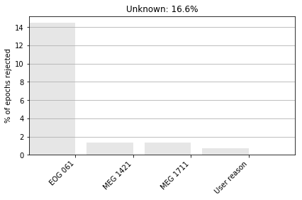

---
redirect_from:
  - "/raw-to-evoked/epochs"
interact_link: content/raw_to_evoked/epochs.ipynb
kernel_name: python3
title: 'Epochs'
prev_page:
  url: /raw_to_evoked/raw
  title: 'Raw data'
next_page:
  url: /raw_to_evoked/evoked
  title: 'Evoked'
comment: "***PROGRAMMATICALLY GENERATED, DO NOT EDIT. SEE ORIGINAL FILES IN /content***"
---


{:.input_area}
```python
%matplotlib inline
```


The [mne.Epochs](https://martinos.org/mne/dev/generated/mne.Epochs.html) data structure: epoched data
=============================================================

[Epochs](https://martinos.org/mne/dev/generated/mne.Epochs.html) objects are a way of representing continuous
data as a collection of time-locked trials, stored in an array of shape
``(n_events, n_channels, n_times)``. They are useful for many statistical
methods in neuroscience, and make it easy to quickly overview what occurs
during a trial.


Creating epochs
------------------------

[Epochs](https://martinos.org/mne/dev/generated/mne.Epochs.html) objects can be created in three ways:
 1. From a [Raw](https://martinos.org/mne/stable/generated/mne.io.Raw.html) object, along with event times
 2. From an [Epochs](https://martinos.org/mne/dev/generated/mne.Epochs.html) object that has been saved as a
    `.fif` file
 3. From scratch using [EpochsArray](https://martinos.org/mne/dev/generated/mne.EpochsArray.html#mne.EpochsArray). See
    [Creating MNE's data structures from scratch](https://martinos.org/mne/stable/auto_tutorials/plot_creating_data_structures.html#tut-creating-data-structures)


Import packages


{:.input_area}
```python
import mne
import os.path as op
import numpy as np
from matplotlib import pyplot as plt
```


Then, we will load the data


{:.input_area}
```python
data_path = mne.datasets.sample.data_path()
# Load a dataset that contains events
raw = mne.io.read_raw_fif(
    op.join(data_path, 'MEG', 'sample', 'sample_audvis_raw.fif'))
```


{:.output .output_stream}
```
Opening raw data file /local_mount/space/meghnn/1/users/mjas/mne_data/MNE-sample-data/MEG/sample/sample_audvis_raw.fif...
    Read a total of 3 projection items:
        PCA-v1 (1 x 102)  idle
        PCA-v2 (1 x 102)  idle
        PCA-v3 (1 x 102)  idle
    Range : 25800 ... 192599 =     42.956 ...   320.670 secs
Ready.
Current compensation grade : 0

```

Extract events
--------------


{:.input_area}
```python
# If your raw object has a stim channel, you can construct an event array
# easily
events = mne.find_events(raw, stim_channel='STI 014')

# Show the number of events (number of rows)
print('Number of events:', len(events))

# Show all unique event codes (3rd column)
print('Unique event codes:', np.unique(events[:, 2]))
```


{:.output .output_stream}
```
320 events found
Event IDs: [ 1  2  3  4  5 32]
Number of events: 320
Unique event codes: [ 1  2  3  4  5 32]

```

Specify event codes of interest with descriptive labels.


{:.input_area}
```python
# This dataset also has visual left (3) and right (4) events, but
# to save time and memory we'll just look at the auditory conditions
# for now.
event_id = {'Auditory/Left': 1, 'Auditory/Right': 2}
```


Expose the raw data as epochs, cut from -0.1 s to 1.0 s relative to the event
onsets


{:.input_area}
```python
epochs = mne.Epochs(raw, events, event_id, tmin=-0.1, tmax=1,
                    baseline=(None, 0), preload=True)
print(epochs)
```


{:.output .output_stream}
```
145 matching events found
Applying baseline correction (mode: mean)
Not setting metadata
Created an SSP operator (subspace dimension = 3)
3 projection items activated
Loading data for 145 events and 662 original time points ...
0 bad epochs dropped
<Epochs  |   145 events (all good), -0.0998976 - 1.00064 sec, baseline [None, 0], ~279.0 MB, data loaded,
 'Auditory/Left': 72
 'Auditory/Right': 73>

```

Note that epochs constructed in this manner will not have their
data available until explicitly read into memory, which you can do with
[get_data](https://martinos.org/mne/dev/generated/mne.Epochs.html#mne.Epochs.get_data). Alternatively, you can use
`preload=True`.

Epochs behave similarly to [`mne.io.Raw`](https://martinos.org/mne/dev/generated/mne.io.Raw.html#mne.io.Raw) objects. They have an
[`info`](https://martinos.org/mne/dev/generated/mne.Info.html#mne.Info) attribute that has all of the same
information, as well as a number of attributes unique to the events contained
within the object.


{:.input_area}
```python
print(epochs.events[:3])
print(epochs.event_id)
```


{:.output .output_stream}
```
[[27977     0     2]
 [28771     0     1]
 [29652     0     2]]
{'Auditory/Left': 1, 'Auditory/Right': 2}

```

Indexing epochs
------------------------

You can select subsets of epochs by indexing the [Epochs](https://martinos.org/mne/dev/generated/mne.Epochs.html) 
object directly. Alternatively, if you have epoch names specified in
`event_id` then you may index with strings instead.


{:.input_area}
```python
print(epochs[1:5])
print(epochs['Auditory/Right'])
```


{:.output .output_stream}
```
<Epochs  |   4 events (all good), -0.0998976 - 1.00064 sec, baseline [None, 0], ~11.2 MB, data loaded,
 'Auditory/Left': 2
 'Auditory/Right': 2>
<Epochs  |   73 events (all good), -0.0998976 - 1.00064 sec, baseline [None, 0], ~142.3 MB, data loaded,
 'Auditory/Right': 73>

```

Note the '/'s in the event code labels. These separators allow tag-based
selection of epoch sets; every string separated by '/' can be entered, and
returns the subset of epochs matching any of the strings. E.g.,


{:.input_area}
```python
print(epochs['Right'])
print(epochs['Right', 'Left'])
```


{:.output .output_stream}
```
<Epochs  |   73 events (all good), -0.0998976 - 1.00064 sec, baseline [None, 0], ~142.3 MB, data loaded,
 'Auditory/Right': 73>
<Epochs  |   145 events (all good), -0.0998976 - 1.00064 sec, baseline [None, 0], ~279.0 MB, data loaded,
 'Auditory/Left': 72
 'Auditory/Right': 73>

```

Note that MNE will not complain if you ask for tags not present in the
object, as long as it can find some match: the below example is parsed as
(inclusive) 'Right' OR 'Left'. However, if no match is found, an error is
returned.


{:.input_area}
```python
epochs_r = epochs['Right']
epochs_still_only_r = epochs_r[['Right', 'Left']]
print(epochs_still_only_r)

try:
    epochs_still_only_r["Left"]
except KeyError:
    print("Tag-based selection without any matches raises a KeyError!")
```


{:.output .output_stream}
```
<Epochs  |   73 events (all good), -0.0998976 - 1.00064 sec, baseline [None, 0], ~142.3 MB, data loaded,
 'Auditory/Right': 73>
Tag-based selection without any matches raises a KeyError!

```

It is also possible to iterate through [`Epochs`](https://martinos.org/mne/stable/generated/mne.Epochs.html#mne.Epochs) objects
in this way. Note that behavior is different if you iterate on `Epochs`
directly rather than indexing:


{:.input_area}
```python
# These will be epochs objects
for i in range(3):
    print(epochs[i])

# These will be arrays
for ep in epochs[:2]:
    print(ep)
```


{:.output .output_stream}
```
<Epochs  |   1 events (all good), -0.0998976 - 1.00064 sec, baseline [None, 0], ~5.5 MB, data loaded,
 'Auditory/Right': 1>
<Epochs  |   1 events (all good), -0.0998976 - 1.00064 sec, baseline [None, 0], ~5.5 MB, data loaded,
 'Auditory/Left': 1>
<Epochs  |   1 events (all good), -0.0998976 - 1.00064 sec, baseline [None, 0], ~5.5 MB, data loaded,
 'Auditory/Right': 1>
[[-1.56510152e-12 -6.00746037e-13  3.63609444e-13 ... -5.42252344e-12
  -3.49381248e-12  8.07845329e-12]
 [ 4.71111366e-12  2.78240270e-12 -1.10663744e-13 ... -2.03937471e-12
  -1.07501922e-12  1.81804722e-12]
 [ 1.27694161e-13  1.26810933e-13  8.74659808e-14 ...  3.27176412e-14
   5.59107736e-14  6.80975243e-14]
 ...
 [-7.88218509e-06 -9.77900515e-06 -9.28950320e-06 ... -6.53605473e-06
  -7.14793216e-06 -8.80000125e-06]
 [-6.95813002e-06 -8.06909195e-06 -7.19201674e-06 ... -6.25646985e-06
  -6.60729993e-06 -8.36145036e-06]
 [ 1.26772322e-05  1.26772322e-05  1.33309187e-05 ... -1.41239155e-05
  -1.41239155e-05 -1.15091693e-05]]
[[-1.38645862e-11 -1.48289417e-11 -1.48289417e-11 ...  4.45816796e-12
   4.45816796e-12  8.31558988e-12]
 [-9.01119056e-12 -1.19042570e-11 -1.28686125e-11 ...  1.59671973e-12
   3.52543069e-12  3.52543069e-12]
 [-6.12059507e-13 -6.39043401e-13 -7.73632967e-13 ...  1.21753954e-14
   2.69203700e-14  7.25978380e-15]
 ...
 [-4.51786226e-06 -4.76261324e-06 -2.74341769e-06 ...  3.89254358e-05
   3.80688074e-05  3.61107996e-05]
 [-1.06849808e-05 -1.15035843e-05 -1.05680374e-05 ...  2.79648003e-05
   2.49242729e-05  2.21761039e-05]
 [ 3.34344584e-06  7.28699735e-07 -3.19341943e-06 ...  7.50132080e-08
  -5.78673319e-07  3.34344584e-06]]

```

Dropping epochs
-------------------------

* Manually by using [epochs.drop(idx)](https://martinos.org/mne/stable/generated/mne.Epochs.html#mne.Epochs.drop), 
* Using rejection or flat thresholds with [epochs.drop_bad(reject, flat)](https://martinos.org/mne/stable/generated/mne.Epochs.html#mne.Epochs.drop_bad).


{:.input_area}
```python
epochs.drop([0], reason='User reason')
epochs.drop_bad(reject=dict(grad=2500e-13, mag=4e-12, eog=200e-6), flat=None)
```


{:.output .output_stream}
```
Dropped 1 epoch
    Rejecting  epoch based on EOG : ['EOG 061']
    Rejecting  epoch based on EOG : ['EOG 061']
    Rejecting  epoch based on EOG : ['EOG 061']
    Rejecting  epoch based on EOG : ['EOG 061']
    Rejecting  epoch based on EOG : ['EOG 061']
    Rejecting  epoch based on EOG : ['EOG 061']
    Rejecting  epoch based on MAG : ['MEG 1711']
    Rejecting  epoch based on EOG : ['EOG 061']
    Rejecting  epoch based on EOG : ['EOG 061']
    Rejecting  epoch based on EOG : ['EOG 061']
    Rejecting  epoch based on MAG : ['MEG 1711']
    Rejecting  epoch based on EOG : ['EOG 061']
    Rejecting  epoch based on EOG : ['EOG 061']
    Rejecting  epoch based on EOG : ['EOG 061']
    Rejecting  epoch based on MAG : ['MEG 1421']
    Rejecting  epoch based on EOG : ['EOG 061']
    Rejecting  epoch based on EOG : ['EOG 061']
    Rejecting  epoch based on EOG : ['EOG 061']
    Rejecting  epoch based on MAG : ['MEG 1421']
    Rejecting  epoch based on EOG : ['EOG 061']
    Rejecting  epoch based on EOG : ['EOG 061']
    Rejecting  epoch based on EOG : ['EOG 061']
    Rejecting  epoch based on EOG : ['EOG 061']
23 bad epochs dropped

```


{:.output .output_data_text}
```
<Epochs  |   121 events (all good), -0.0998976 - 1.00064 sec, baseline [None, 0], ~233.4 MB, data loaded,
 'Auditory/Left': 57
 'Auditory/Right': 64>
```


You can also inspect the reason why epochs were dropped by looking at the
list stored in ``epochs.drop_log`` or plot them with
[epochs.plot_drop_log()](https://martinos.org/mne/stable/generated/mne.Epochs.html#mne.Epochs.plot_drop_log). The indices
from the original set of events are stored in ``epochs.selection``.


{:.input_area}
```python
print(epochs.drop_log)
epochs.plot_drop_log();
```


{:.output .output_stream}
```
[['User reason'], ['IGNORED'], [], ['IGNORED'], [], ['IGNORED'], [], ['IGNORED'], [], ['IGNORED'], [], ['IGNORED'], [], ['IGNORED'], [], ['IGNORED'], ['EOG 061'], ['IGNORED'], ['IGNORED'], [], ['IGNORED'], [], ['IGNORED'], [], ['IGNORED'], [], ['IGNORED'], [], ['IGNORED'], [], ['IGNORED'], [], ['IGNORED'], [], ['IGNORED'], [], ['IGNORED'], ['IGNORED'], [], ['IGNORED'], ['EOG 061'], ['IGNORED'], [], ['IGNORED'], [], ['IGNORED'], [], ['IGNORED'], [], ['IGNORED'], [], ['IGNORED'], [], ['IGNORED'], [], ['IGNORED'], [], ['IGNORED'], [], ['IGNORED'], ['IGNORED'], ['EOG 061'], ['IGNORED'], [], ['IGNORED'], [], ['IGNORED'], [], ['IGNORED'], [], ['IGNORED'], [], ['IGNORED'], [], ['IGNORED'], [], ['IGNORED'], [], ['IGNORED'], ['IGNORED'], ['IGNORED'], ['IGNORED'], ['EOG 061'], ['IGNORED'], ['EOG 061'], ['IGNORED'], ['EOG 061'], ['IGNORED'], [], ['IGNORED'], [], ['IGNORED'], [], ['IGNORED'], [], ['IGNORED'], [], ['IGNORED'], [], ['IGNORED'], ['IGNORED'], [], ['IGNORED'], [], ['IGNORED'], [], ['IGNORED'], [], ['IGNORED'], [], ['IGNORED'], [], ['IGNORED'], [], ['IGNORED'], [], ['IGNORED'], [], ['IGNORED'], ['IGNORED'], ['IGNORED'], ['IGNORED'], [], ['IGNORED'], ['MEG 1711'], ['IGNORED'], [], ['IGNORED'], [], ['IGNORED'], [], ['IGNORED'], [], ['IGNORED'], [], ['IGNORED'], [], ['IGNORED'], [], ['IGNORED'], [], ['IGNORED'], [], ['IGNORED'], ['IGNORED'], [], ['IGNORED'], ['EOG 061'], ['IGNORED'], ['EOG 061'], ['IGNORED'], [], ['IGNORED'], [], ['IGNORED'], [], ['IGNORED'], [], ['IGNORED'], [], ['IGNORED'], [], ['IGNORED'], ['IGNORED'], ['IGNORED'], ['IGNORED'], ['EOG 061'], ['IGNORED'], [], ['IGNORED'], [], ['IGNORED'], ['MEG 1711'], ['IGNORED'], [], ['IGNORED'], [], ['IGNORED'], [], ['IGNORED'], ['EOG 061'], ['IGNORED'], [], ['IGNORED'], [], ['IGNORED'], ['IGNORED'], ['EOG 061'], ['IGNORED'], [], ['IGNORED'], [], ['IGNORED'], [], ['IGNORED'], ['EOG 061'], ['IGNORED'], [], ['IGNORED'], [], ['IGNORED'], [], ['IGNORED'], ['IGNORED'], ['IGNORED'], ['IGNORED'], [], ['IGNORED'], ['MEG 1421', 'EOG 061'], ['IGNORED'], ['EOG 061'], ['IGNORED'], ['EOG 061'], ['IGNORED'], [], ['IGNORED'], ['EOG 061'], ['IGNORED'], [], ['IGNORED'], [], ['IGNORED'], [], ['IGNORED'], [], ['IGNORED'], ['IGNORED'], ['IGNORED'], ['IGNORED'], [], ['IGNORED'], [], ['IGNORED'], [], ['IGNORED'], [], ['IGNORED'], [], ['IGNORED'], [], ['IGNORED'], [], ['IGNORED'], [], ['IGNORED'], [], ['IGNORED'], ['IGNORED'], [], ['IGNORED'], [], ['IGNORED'], [], ['IGNORED'], [], ['IGNORED'], [], ['IGNORED'], [], ['IGNORED'], ['MEG 1421', 'EOG 061'], ['IGNORED'], [], ['IGNORED'], [], ['IGNORED'], ['IGNORED'], ['IGNORED'], ['IGNORED'], [], ['IGNORED'], [], ['IGNORED'], [], ['IGNORED'], ['EOG 061'], ['IGNORED'], ['EOG 061'], ['IGNORED'], ['EOG 061'], ['IGNORED'], [], ['IGNORED'], ['EOG 061'], ['IGNORED'], [], ['IGNORED'], ['IGNORED'], ['IGNORED'], ['IGNORED'], [], ['IGNORED'], [], ['IGNORED'], [], ['IGNORED'], [], ['IGNORED'], [], ['IGNORED'], [], ['IGNORED'], [], ['IGNORED'], [], ['IGNORED'], [], ['IGNORED'], [], ['IGNORED'], [], ['IGNORED'], ['IGNORED'], [], ['IGNORED'], [], ['IGNORED'], [], ['IGNORED'], ['IGNORED']]

```


{:.output .output_png}


Input/Output
------------------

If you wish to save the epochs as a file, you can do it with
[mne.Epochs.save](https://martinos.org/mne/stable/generated/mne.Epochs.html#mne.Epochs.save). To conform to MNE naming conventions, the
epochs file names should end with '-epo.fif'.


{:.input_area}
```python
epochs_fname = op.join(data_path, 'MEG', 'sample', 'sample-epo.fif')
epochs.save(epochs_fname)
```


Later on you can read the epochs with [`mne.read_epochs`](https://martinos.org/mne/dev/generated/mne.read_epochs.html#mne.read_epochs). For reading
EEGLAB epochs files see [`mne.read_epochs_eeglab`](https://martinos.org/mne/dev/generated/mne.read_epochs_eeglab.html#mne.read_epochs_eeglab). We can also use
``preload=False`` to save memory, loading the epochs from disk on demand.


{:.input_area}
```python
epochs = mne.read_epochs(epochs_fname, preload=False)
```


{:.output .output_stream}
```
Reading /local_mount/space/meghnn/1/users/mjas/mne_data/MNE-sample-data/MEG/sample/sample-epo.fif ...
    Read a total of 3 projection items:
        PCA-v1 (1 x 102) active
        PCA-v2 (1 x 102) active
        PCA-v3 (1 x 102) active
    Found the data of interest:
        t =     -99.90 ...    1000.64 ms
        0 CTF compensation matrices available
121 matching events found
Applying baseline correction (mode: mean)
Not setting metadata
Created an SSP operator (subspace dimension = 3)
3 projection items activated

```

If you wish to look at the average across trial types, then you may do so,
creating an [`Evoked`](https://martinos.org/mne/dev/generated/mne.Evoked.html) object in the process. Instances
of `Evoked` are usually created by calling [`mne.Epochs.average`](https://martinos.org/mne/stable/generated/mne.Epochs.html#mne.Epochs.average).


{:.input_area}
```python
ev_left = epochs['Auditory/Left'].average()
ev_right = epochs['Auditory/Right'].average()

f, axs = plt.subplots(3, 2, figsize=(10, 5))
_ = f.suptitle('Left / Right auditory', fontsize=20)
_ = ev_left.plot(axes=axs[:, 0], show=False, time_unit='s')
_ = ev_right.plot(axes=axs[:, 1], show=False, time_unit='s')
plt.tight_layout()
```


{:.output .output_png}



For creating `Evoked` from other data structures see [mne.EvokedArray](https://martinos.org/mne/stable/generated/mne.EvokedArray.html#mne.EvokedArray) and [Creating MNE's data structures from scratch](https://martinos.org/mne/dev/auto_tutorials/plot_creating_data_structures.html#tut-creating-data-structures).

To export and manipulate Epochs using Pandas see
[Export epochs to pandas dataframe](https://martinos.org/mne/stable/auto_tutorials/plot_epochs_to_data_frame.html#sphx-glr-auto-tutorials-plot-epochs-to-data-frame-py),
or to work directly with metadata in MNE-Python see [Pandas querying and metadata with Epochs objects](https://martinos.org/mne/stable/auto_tutorials/plot_metadata_epochs.html#sphx-glr-auto-tutorials-plot-metadata-epochs-py).

Exercises
--------------
1) Can you find out the indices of the epochs that have been removed due to eyeblinks?


{:.input_area}
```python
# your code here
```


2) Can you plot these epochs and verify that these do indeed contain eyeblinks?


{:.input_area}
```python
# your code here
# epochs_eyeblinks.average().plot(spatial_colors=True)
```

